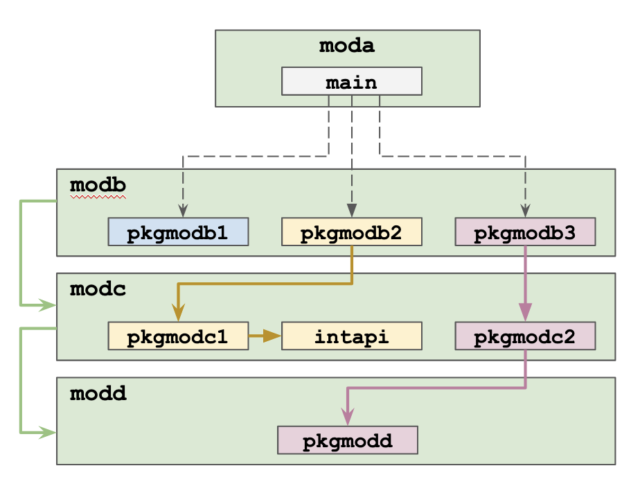

# moda

Module used as part of an example to show how dependency management works.

This module contains only the main package which has only the main function.

We analyze 3 cases:

- main.go imports "github.com/EnricoPicci/modb/pkgmodb1" and calls a function of "pkgmodb1" which does not call any other function
- main.go imports "github.com/EnricoPicci/modb/pkgmodb2" and calls a function of "pkgmodb2" which calls a function of package "pkgmodc2" of another module "modc"
- main.go imports "github.com/EnricoPicci/modb/pkgmodb3" and calls a function of "pkgmodb3" which calls a function of package "pkgmodc2" of module "modc" which calls a function of package "pkgmodd" of module "modd"

The 3 cases are implemented in the main.go file. Two cases are commented out.

## "moda" depends only on a package of "modb"

If the "main" package of "moda" imports "pckmodb1" and calls the only function provided by this package, the go.mod has only 1 direct requirement: "modb". The package list (which can be obtained with the command go list all) contains only "pkgmodb1" (apart all packages of the standard library).

## "moda" depends on a package of "modb" which depends on a package of "modc"

If the "main" package of "moda" imports "pckmodb2" and calls the only function provided by this package, the go.mod has 1 direct requirement, "modb", and 1 indirect requirement "modc". The package list (which can be obtained with the command go list all) contains "pckmodb2", "pkgmodc1" and "intapi" (apart all packages of the standard library) since the package "pkgmodc1" of "modc" imports the package "intapi" of "modc" itself.

## "moda" depends on a package of "modb" which depends on a package of "modc" which depends on a package of "modd"

If the "main" package of "moda" imports "pckmodb3" and calls the only function provided by this package, the go.mod has 1 direct requirement, "modb", and 2 indirect requirements: "modc" and "modd". The package list (which can be obtained with the command go list all) contains "pckmodb3", "pkgmodc2" and "pkgmodd" (apart all packages of the standard library) since the package "pkgmodb2" of "modc" imports the package "pkgmodd" of "modd".
