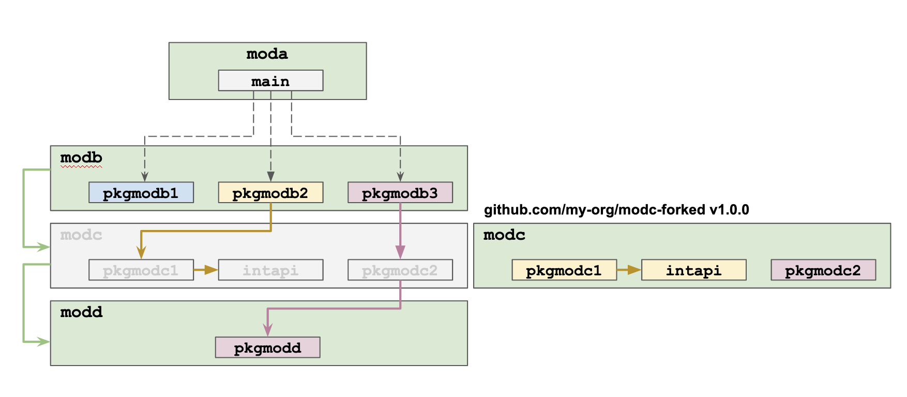

# moda with replacement of a module

Module used as part of an example to show how dependency management works when a module is replaced by another module with the same name.

This module contains only the main package which has only the main function.

main.go imports "github.com/EnricoPicci/modb/pkgmodb3" and calls a function of "pkgmodb3" which calls a function of package "pkgmodc2" of module "modc" which calls a function of package "pkgmodd" of module "modd".

We replace "modc v1.5.0", which is the module transitively imported (since it is the module at the version imported by "modb") with a forked version "github.com/EnricoPicci/modc-forked v1.0.0". This can be seen in the [go.mod](./go.mod) file where there is a replace directive.

The replacement effect is that the replaced module is what is actually used when running this program (e.g. with the command `go run ./main`)

